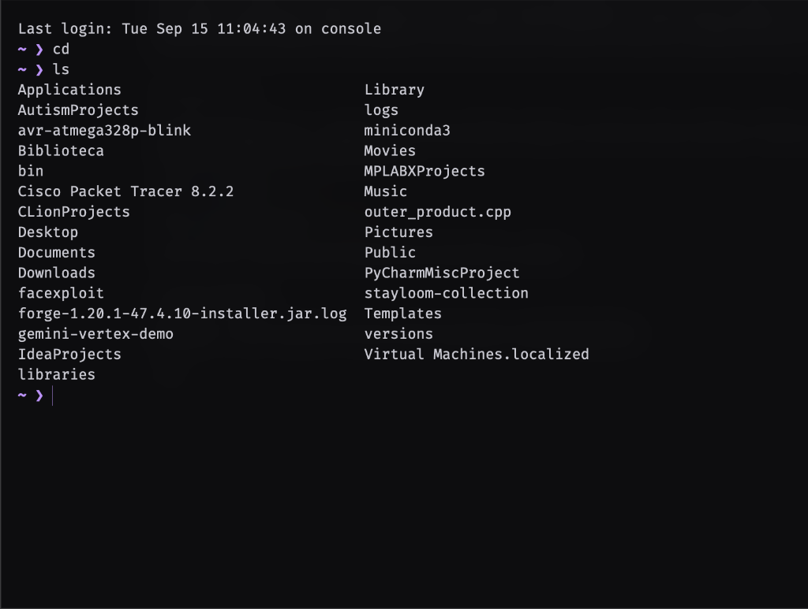
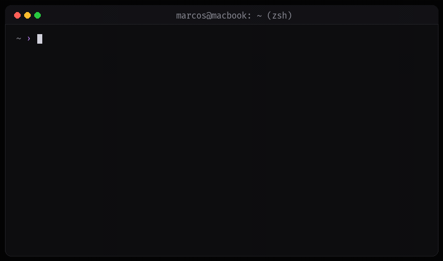

<div align="center">



# pudding

**Natural language execution in your terminal.**  
Zero dependencies. Works with any OpenAI-compatible endpoint (DeepSeek, Ollama, OpenAI). No daemons, no tracking, no bloat.

<br/>



</div>

---

## What is it?

Most terminal AI tools are either bloated electron apps, closed-source subscription services, background daemons chewing up CPU, or spam you with emojis and paragraphs of text.

**pudding** is a tiny, single-file bridge (~300 lines of standard library Python) hooked directly into your shell (`zsh` / `bash`):

- **Zero dependencies**: Uses only Python standard library (`urllib`, `json`, `subprocess`). No `pip install`, no `node_modules`.
- **Works with any endpoint**: DeepSeek, local Ollama (100% offline & free), OpenAI, Groq, LiteLLM, vLLM.
- **Fast command generation**: Translates intent into the exact command (chained `&&`, flags, pipes) and prompts to run with a single keypress (`Enter`).
- **Instant system queries**: Inspects RAM, disk, CPU, and network directly without dumping confusing kernel pages or raw tables.
- **Clean output**: No markdown fluff, no emojis, no commentary. Just the command or the metric.

---

## Install

Run the 1-step installer:

```bash
git clone https://github.com/marcosdeaza/pudding.git
cd pudding
./install.sh
source ~/.zshrc    # or source ~/.bashrc
```

That's it. It installs `pudding` to `~/.local/bin` and adds the shell hook.

---

## Configuration

Set your model provider in `~/.zshrc` (or `~/.config/pudding/config.json`):

### DeepSeek (Fast & Cheap)
```bash
export PUDDING_API_KEY="sk-your-deepseek-key"
export PUDDING_MODEL="deepseek-chat"
export PUDDING_API_BASE="https://api.deepseek.com/v1/chat/completions"
```

### Local Ollama (Free & Private)
```bash
export PUDDING_API_BASE="http://localhost:11434/v1/chat/completions"
export PUDDING_MODEL="llama3.2"
export PUDDING_API_KEY="ollama-local"
```

### OpenAI
```bash
export PUDDING_API_KEY="sk-proj-your-openai-key"
export PUDDING_MODEL="gpt-4o-mini"
export PUDDING_API_BASE="https://api.openai.com/v1/chat/completions"
```

---

## How to use

### 1. The `?` trigger
Prefix any request or question with `?`:

```bash
~ › ? go to downloads
  › cd ~/Downloads
  Execute? [Y/n]

~ › ? compile and run outer_product.cpp with O3
  › g++ -O3 -std=c++17 outer_product.cpp -o outer_product && ./outer_product
  Execute? [Y/n]

~ › ? how much ram is free
  › RAM: 6.2 GB free of 16.0 GB (9.8 GB in use)
  › Disk: 215 GB free of 460 GB

~ › ? kill the process using port 3000
  › lsof -ti :3000 | xargs kill -9
  Execute? [Y/n]
```

Hit **Enter** or **Y** to run, **n** to cancel.

### 2. Direct natural language
You don't even need the `?`. If you type a natural language sentence into your shell, pudding intercepts the command-not-found handler and translates it directly:

```bash
~ › go to desktop
  › cd ~/Desktop
  Execute? [Y/n]
```

### 3. Ask technical questions (`ai`)
When you want quick answers or technical explanations directly in your terminal:

```bash
ai "difference between std::vector and std::array in cpp"
ai "how does a SYN flood attack work and how to detect it with tcpdump"
```

---

## Terminal Setup (Ghostty)

**pudding** works in any shell/terminal, but pairs especially well with **[Ghostty](https://ghostty.org)** and a clean monochrome aesthetic.

If you want the minimal setup:
- Copy `extras/ghostty-noir.config` to `~/.config/ghostty/config`
- Copy `extras/starship-noir.toml` to `~/.config/starship.toml`

---

## Repository Structure

```
pudding/
├── bin/
│   └── pudding             # Pure Python CLI (standard library only)
├── shell/
│   ├── pudding.zsh         # Zsh hook & aliases
│   └── pudding.bash        # Bash hook & aliases
├── config/
│   └── config.example.json # JSON config alternative
├── extras/
│   ├── ghostty-noir.config # Minimal Ghostty theme
│   └── starship-noir.toml  # Minimal Starship prompt
├── assets/
│   └── banner.png          # Terminal preview banner
├── install.sh              # 1-step installer
├── uninstall.sh            # Clean removal script
└── LICENSE                 # MIT
```

---

## License

MIT © Marcos de Aza
